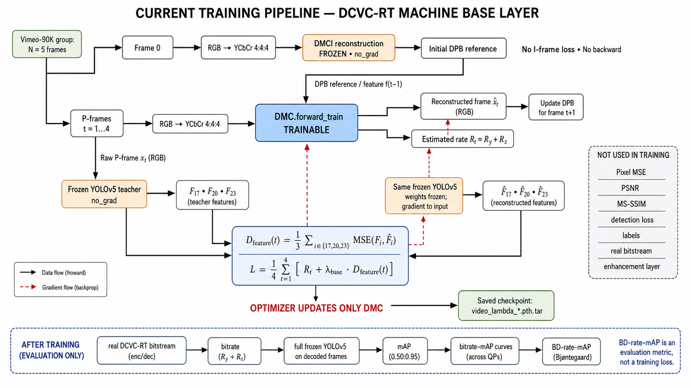

# SVC machine base layer with DCVC-RT

This repository keeps the machine base-layer pipeline from *Learned Scalable Video Coding for Humans and Machines* and replaces its image/video codec with Microsoft's pretrained [DCVC-RT](https://github.com/microsoft/DCVC/tree/main/DCVC-family/DCVC-RT).

```text
input PNG -> DCVC-RT bitstream -> reconstructed PNG -> YOLOv5 -> mAP
          -> bitrate (kbps) + anchor VTM curve -> BD-rate-mAP
```

The enhancement layer and the PSNR, SSIM, MS-SSIM and reconstruction-MSE evaluation paths are removed. The remaining metrics follow `wg2n00231_r1.docx`: video rate is measured in kbps, object detection is measured by mAP, and the final comparison against the VTM anchor is BD-rate-mAP.

## Models

- `DMCI` with `cvpr2025_image.pth.tar` encodes each GOP's I-frame.
- `DMC` with `cvpr2025_video.pth.tar` encodes the following P-frames.
- `yolov5s.pt` evaluates the reconstructed frames for the original paper's machine task.

The official DCVC-RT source is vendored under `dcvc_rt/` and pinned in `dcvc_rt/UPSTREAM.md` with its license and notice.

The repository is intentionally minimal: root code contains only base-layer training/evaluation and BD-rate-mAP calculation; `dcvc_rt/src/` contains the active codec and build sources; `models/` and `utils/` contain only the required YOLOv5 code. Legacy CANF/PWC/SDC codecs, enhancement code, segmentation, export and logging utilities have been removed.

## Current training pipeline



## Installation and checkpoints

DCVC-RT recommends Python 3.12, PyTorch 2.6 and CUDA 12.6.

```bash
pip install torch torchvision --index-url https://download.pytorch.org/whl/cu126
pip install -r requirements.txt

cd dcvc_rt/src/cpp
pip install .
cd ../layers/extensions/inference
pip install .
cd ../../../..
```

Download the two official checkpoints from the [Microsoft checkpoint folder](https://1drv.ms/f/c/2866592d5c55df8c/Esu0KJ-I2kxCjEP565ARx_YB88i0UnR6XnODqFcvZs4LcA?e=by8CO8):

```text
checkpoints/dcvc_rt/cvpr2025_image.pth.tar
checkpoints/dcvc_rt/cvpr2025_video.pth.tar
```

## Train the machine base layer

Prepare Vimeo-90K Septuplet in its standard layout:

```text
vimeo_septuplet/
  sep_trainlist.txt
  sequences/00001/0001/im1.png ... im7.png
```

The default trains one variable-rate model. Every batch samples one integer base QP uniformly from `0..63` and interpolates the machine-task weight in log space:

```text
lambda_task(qp) = 2 * 8^(qp / 63)

QP       0    21    42    63
lambda   2     4     8    16
```

For the five-frame group, the DCVC-RT hierarchical offsets are `[0,8,0,4,0]`. Frame 0 initializes the DPB through frozen DMCI; only frames 1 through 4 contribute to the loss:

```text
L = mean_t(rate_P(t) + lambda_task(qp) *
    (MSE(F17, Fhat17) + MSE(F20, Fhat20) + MSE(F23, Fhat23)) / 3)
```

There is no I-frame loss, pixel MSE, detection loss, PSNR, MS-SSIM, enhancement-layer loss, or label requirement during training. Only `DMC` is optimized; DMCI and every YOLOv5-small parameter remain frozen. The defaults retain the paper protocol: random `256x256` crop, five consecutive frames, batch size 4, Adam at `1e-6`, and 10 epochs.

First check the interpolation and dataset:

```bash
python train_base.py --self_check
python train_base.py --dataset /path/to/vimeo_septuplet --check_dataset
```

Edit `validation_config.example.json` with a labelled validation sequence and its measured VTM anchor, then train:

```bash
python train_base.py \
  --dataset /path/to/vimeo_septuplet \
  --validation_config ./validation_config.example.json \
  --validation_interval 1
```

After each validation, the same checkpoint is encoded at QPs `0 21 42 63`; actual bitrate and frozen-YOLO mAP are used to calculate BD-rate-mAP. The lowest validation BD-rate is selected automatically:

```text
checkpoints/base_task/video_variable_rate_last.pth.tar
checkpoints/base_task/video_variable_rate_best.pth.tar
checkpoints/base_task/variable_rate_validation_history.json
```

Omit `--validation_config` only when periodic selection is not required; in that case only the `last` checkpoint is available. Validation does not save reconstructed PNGs.

Train the requested fixed-rate baseline with QP 42 and lambda 8 using the same validation data:

```bash
python train_base.py \
  --dataset /path/to/vimeo_septuplet \
  --mode fixed \
  --fixed_qp 42 \
  --validation_config ./validation_config.example.json
```

Its outputs are named `video_fixed_qp42_last.pth.tar`, `video_fixed_qp42_best.pth.tar`, and `fixed_qp42_validation_history.json`. Compare its QP-42 point with the variable-rate model's QP-42 point in the two validation histories.

## VTM anchor input

The CTC document supplies anchor QPs but not measured bitrate-mAP values. Run the VTM anchor and provide at least four measured points as JSON. mAP values must use the same `0..1` scale and the same variant as the proposal.

```json
{
  "points": [
    {"bitrate_kbps": 100.0, "map50_95": 0.20},
    {"bitrate_kbps": 200.0, "map50_95": 0.30},
    {"bitrate_kbps": 400.0, "map50_95": 0.40},
    {"bitrate_kbps": 800.0, "map50_95": 0.50}
  ]
}
```

Replace these example values with the VTM results for the same sequence, frames, FPS, detector and mAP definition.

## Run

Input images and YOLO labels must have matching names such as `Parkscene_000.png` and `Parkscene_000.txt`. Labels use normalized `class x_center y_center width height` format.

```bash
python test_base.py \
  --qps 0 21 42 63 \
  --model_path_i ./checkpoints/dcvc_rt/cvpr2025_image.pth.tar \
  --model_path_p ./checkpoints/base_task/video_variable_rate_best.pth.tar \
  --inp_path ./input/ParkScene \
  --labels_path ./labels/ParkScene \
  --out_path ./out/ParkScene \
  --prefix Parkscene_ \
  --fps 24 \
  --no_frames 100 \
  --gop 32 \
  --anchor_path ./anchors/ParkScene.json
```

The single variable-rate checkpoint is reused at all four QPs. Reconstructed PNG files and the actual DCVC-RT `.bin` stream are written under `out/ParkScene/qp_<QP>/`. Bitrate is measured from that stream's file size. The proposal curve and `bd_rate_map_percent` are written to `machine_metrics.json`; a negative BD-rate-mAP means bitrate saving over the anchor at equal mAP.

Use `--map_metric map50` when the anchor contains `map50`; the default is `map50_95`, corresponding to the average over IoU thresholds `0.50:0.05:0.95` defined by the CTC document.

This follows the paper's base-layer loss and schedule while using DCVC-RT as requested. Because the codec backbone differs from the paper's original codec, its published numerical results are not expected to match exactly.
