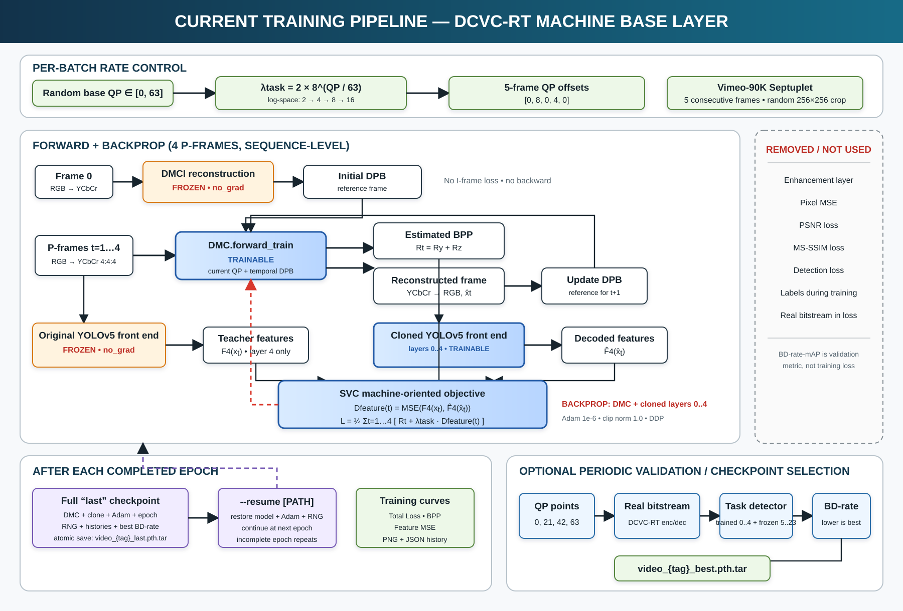

# SVC machine base layer with DCVC-RT

This repository keeps the machine base-layer pipeline from *Learned Scalable Video Coding for Humans and Machines* and replaces its image/video codec with Microsoft's pretrained [DCVC-RT](https://github.com/microsoft/DCVC/tree/main/DCVC-family/DCVC-RT).

```text
input PNG -> DCVC-RT bitstream -> reconstructed PNG -> YOLOv5 -> mAP
          -> bitrate (kbps) + anchor VTM curve -> BD-rate-mAP
```

The enhancement layer and the PSNR, SSIM, MS-SSIM and reconstruction-MSE evaluation paths are removed. The remaining metrics follow `wg2n00231_r1.docx`: video rate is measured in kbps, object detection is measured by mAP, and the final comparison against the VTM anchor is BD-rate-mAP.

## Models

- `DMCI` with `cvpr2025_image.pth.tar` encodes each GOP's I-frame.
- `DMC` with `cvpr2025_video.pth.tar` encodes the following P-frames.
- `yolov5s.pt` supplies the frozen teacher and initializes the also-frozen cloned front-end (layers `0..4`). Its back-end (layers `5..23`) stays frozen for detection evaluation.

The official DCVC-RT source is vendored under `dcvc_rt/` and pinned in `dcvc_rt/UPSTREAM.md` with its license and notice.

The active project is split by responsibility:

```text
svc_machine/          SVC feature supervision and rate-task loss
dcvc_rt/              active DMCI/DMC codec implementation
train_base.py         five-frame SVC training schedule and orchestration
test_base.py          base-layer coding and BD-rate-mAP evaluation
legacy_svc_base/      original CANF/PWC/SDC base codec, reference only
models/ + utils/      required frozen YOLOv5 code
```

The enhancement layer, human-viewing path and unrelated YOLO utilities remain removed. The original SVC base-codec source is preserved under `legacy_svc_base/` for traceability but is not imported at runtime.

## Current training pipeline



## Installation and checkpoints

DCVC-RT recommends Python 3.12, PyTorch 2.6 and CUDA 12.6.

```bash
pip install torch torchvision --index-url https://download.pytorch.org/whl/cu126
pip install -r requirements.txt

cd dcvc_rt/src/cpp
pip install .
cd ../layers/extensions/inference
pip install .
cd ../../../..
```

Download the two official checkpoints from the [Microsoft checkpoint folder](https://1drv.ms/f/c/2866592d5c55df8c/Esu0KJ-I2kxCjEP565ARx_YB88i0UnR6XnODqFcvZs4LcA?e=by8CO8):

```text
checkpoints/dcvc_rt/cvpr2025_image.pth.tar
checkpoints/dcvc_rt/cvpr2025_video.pth.tar
```

## Train the machine base layer

Prepare Vimeo-90K Septuplet in its standard layout:

```text
vimeo_septuplet/
  sep_trainlist.txt
  sequences/00001/0001/im1.png ... im7.png
```

The current mid-rate experiment trains one variable-rate model. For each batch, QP is sampled from `16..47` with probability `0.6`, otherwise uniformly from `0..63`. This gives the weak QP 21/42 region about four times the sampling density of the extremes while retaining both endpoints. The machine-task weight is interpolated in log space:

```text
lambda_task(qp) = 4 * 8^(qp / 63)

QP       0    21    42    63
lambda   4     8    16    32
```

For the five-frame group, the DCVC-RT hierarchical offsets are `[0,8,0,4,0]`. Frame 0 initializes the DPB through frozen DMCI; only frames 1 through 4 contribute to the loss:

```text
L = mean_t(rate_P(t) + lambda_task(qp) * MSE(F4(x_t), Fclone4(xhat_t)))
```

There is no I-frame loss, pixel MSE, detection loss, PSNR, MS-SSIM, enhancement-layer loss, or label requirement during training. Adam optimizes only `DMC`; DMCI, the original YOLO teacher, the cloned YOLO front-end `0..4`, and YOLO back-end `5..23` are all frozen. Gradients still pass through the frozen clone to the reconstructed frame and DMC. The defaults retain the SVC protocol: random `256x256` crop, five consecutive frames, global batch size 4, Adam at `1e-6`, and 10 epochs. Gradients are clipped to norm `1.0` by default.

First check the interpolation and dataset:

```bash
python train_base.py --self_check
python train_base.py --dataset /path/to/vimeo_septuplet --check_dataset
```

Train without an HEVC anchor:

```bash
python train_base.py \
  --dataset /path/to/vimeo_septuplet
```

For DDP, keep `--batch_size 4` as the global batch size and choose a process count that divides four:

```bash
torchrun --standalone --nproc_per_node=2 train_base.py \
  --dataset /path/to/vimeo_septuplet
```

The trainer saves a lightweight candidate at each validation interval. If `--validation_config` is supplied, rank 0 evaluates those candidates after DDP training at QPs `0 21 42 63` using actual bitstreams, the same manifest/detector as the HEVC anchor, and selects the lowest BD-rate-mAP automatically:

```text
checkpoints/base_task/video_variable_rate_last.pth.tar
checkpoints/base_task/video_variable_rate_epoch_0001.pth
checkpoints/base_task/best.pth
checkpoints/base_task/best_validation.json
checkpoints/base_task/variable_rate_training_history.json
checkpoints/base_task/variable_rate_training_curves.png
checkpoints/base_task/variable_rate_training_curves_epoch_0001.png
checkpoints/base_task/variable_rate_validation_history.json
```

`variable_rate_training_curves.png` contains separate Total Loss, BPP and Feature MSE plots. The JSON/latest plot are refreshed after every completed epoch, and an epoch-numbered plot is retained for every epoch. `best.pth` records the selected epoch and both BD-rate-mAP50 and BD-rate-mAP50:95 results.

Every epoch also evaluates `sep_testlist.txt` with frames `im1..im5`, a deterministic centre crop and QPs cycling through `0,21,42,63`. Each chart contains `train` and `validation` lines, and the lowest held-out total loss is saved as `best_val_loss.pth`. This checkpoint is an overfitting monitor; `best.pth` remains reserved for the later BD-rate-mAP selection.

If training is interrupted, continue from the next epoch stored in the default `last` checkpoint. `--epochs` is the final total, not the number of additional epochs:

```bash
python train_base.py \
  --dataset /path/to/vimeo_septuplet \
  --epochs 10 \
  --resume
```

Use `--resume /path/to/checkpoint.pth.tar` for an explicit checkpoint. The checkpoint restores DMC, the frozen cloned front-end, DMC-only Adam, Python/Torch/CUDA RNG state, histories, and the next epoch. DDP resume requires the same process count. An interruption inside an epoch repeats that incomplete epoch because checkpoints are committed only after complete epochs.

Checkpoints from the earlier optimizer or `lambda=2..16` experiment use schema 2/3 and cannot be resumed into this schema-4 experiment; start the new run from the DCVC-RT pretrained checkpoint.

`--validation_config` is optional and HEVC never participates in optimization. Without it, training produces `last` and epoch candidates but no genuine BD-rate-selected `best.pth`. After creating the HEVC result, rerun the completed job with `--resume --validation_config ./validation_config.example.json`; no epoch is retrained and the saved candidates are evaluated. `--validation_interval 1` retains every epoch; a larger value retains only those intervals and the final epoch.

Train the requested fixed-rate baseline with QP 42 and lambda 16 using the same validation data:

```bash
python train_base.py \
  --dataset /path/to/vimeo_septuplet \
  --mode fixed \
  --fixed_qp 42 \
  --validation_config ./validation_config.example.json
```

Its outputs use the same naming pattern with the `fixed_qp42` tag. Compare its QP-42 point with the variable-rate model's QP-42 point in the two validation histories.

## VTM anchor input

The CTC document supplies anchor QPs but not measured bitrate-mAP values. Run the VTM anchor and provide at least four measured points as JSON. mAP values must use the same `0..1` scale and the same variant as the proposal.

```json
{
  "points": [
    {"bitrate_kbps": 100.0, "map50_95": 0.20},
    {"bitrate_kbps": 200.0, "map50_95": 0.30},
    {"bitrate_kbps": 400.0, "map50_95": 0.40},
    {"bitrate_kbps": 800.0, "map50_95": 0.50}
  ]
}
```

Replace these example values with the VTM results for the same sequence, frames, FPS, detector and mAP definition.

## Run

Input images and YOLO labels must have matching names such as `Parkscene_000.png` and `Parkscene_000.txt`. Labels use normalized `class x_center y_center width height` format.

```bash
python test_base.py \
  --qps 0 21 42 63 \
  --model_path_i ./checkpoints/dcvc_rt/cvpr2025_image.pth.tar \
  --model_path_p ./checkpoints/base_task/best.pth \
  --inp_path ./input/ParkScene \
  --labels_path ./labels/ParkScene \
  --out_path ./out/ParkScene \
  --prefix Parkscene_ \
  --fps 24 \
  --no_frames 100 \
  --gop 32 \
  --anchor_path ./anchors/ParkScene.json
```

The single variable-rate checkpoint, including its frozen cloned front-end, is reused at all four QPs. Its cloned layers `0..4` replace the detector's original front-end while frozen layers `5..23` produce detections. Reconstructed PNG files and the actual DCVC-RT `.bin` stream are written under `out/ParkScene/qp_<QP>/`. Bitrate is measured from that stream's file size. The evaluator requires exactly QPs `0,21,42,63`, four finite positive-rate Pareto points, a common front-end policy, and overlapping anchor/proposal mAP ranges. The proposal curve and `bd_rate_map_percent` are written to `machine_metrics.json`; a negative value means bitrate saving over the anchor at equal mAP.

Use `--map_metric map50` when the anchor contains `map50`; the default is `map50_95`, corresponding to the average over IoU thresholds `0.50:0.05:0.95` defined by the CTC document.

This is not identical to the other DCVC-RT repository: only its codec and reliability mechanisms are reused. The five-frame SVC feature objective, layer-4 teacher/clone supervision, Adam `1e-6`, focused QP sampling and lambda range `4..32` remain project-specific. Because the codec backbone differs from the paper's original codec, its published numerical results are not expected to match exactly.

## HEVC x265 comparison using the reference evaluator

`evaluate_hevc.py` and the manifest/evaluation utilities are ported from
[`uetot1/DCVC-RT`](https://github.com/uetot1/DCVC-RT) at commit
`6cb7bcf6b30c3c51f712fc14541302740c603a3c`. The evaluator reads the repository's
native manifest schema (`sequences`, not a top-level `prefix`), encodes an RGB
source as BT.709 YUV444 10-bit Low-Delay P, evaluates every decoded frame with
the frozen YOLO detector, counts complete HEVC bitstreams, and resumes after
each completed sequence.

```bash
python evaluate_hevc.py \
  --data-dir /kaggle/input/class-d/vcm_eval \
  --dataset-manifest /kaggle/input/class-d/vcm_eval/manifest.json \
  --x265-encoder x265 \
  --qps 22 27 32 37 42 47 \
  --chroma-format 444 \
  --bit-depth 10 \
  --preset medium \
  --yolov5-weights ./yolov5s.pt \
  --resume \
  --keep-progress-checkpoint
```

Evaluate the trained SVC/DCVC-RT base checkpoint with the identical manifest
and detector:

```bash
python evaluate_vcm.py --mode codec \
  --data-dir /kaggle/input/class-d/vcm_eval \
  --dataset-manifest /kaggle/input/class-d/vcm_eval/manifest.json \
  --image-ckpt /kaggle/input/pre-trained-model/cvpr2025_image.pth.tar \
  --video-ckpt /kaggle/input/latest/video_variable_rate_last.pth \
  --qps 0 21 42 63 \
  --reset-interval 64 \
  --force-zero-thres 0.12 \
  --yolov5-weights ./yolov5s.pt \
  --method-name dcvc_rt_svc_base_epoch20
```

Finally compute both BD-rate-mAP values and create two separate plots:

```bash
python evaluate_vcm.py --mode bdrate \
  --anchor-results output/hevc_evaluation/hevc_x265_ldp_rgb444_10bit_results.json \
  --candidate-results output/evaluation/dcvc_rt_svc_base_epoch20_results.json \
  --rate actual_bpp \
  --metric map5095 \
  --output-dir output/comparison_x265
```

The plots are `rd_curve_actual_bpp_map50.png` and
`rd_curve_actual_bpp_map5095.png`; `bd_rate_map.json` contains numeric results
for both metrics.
