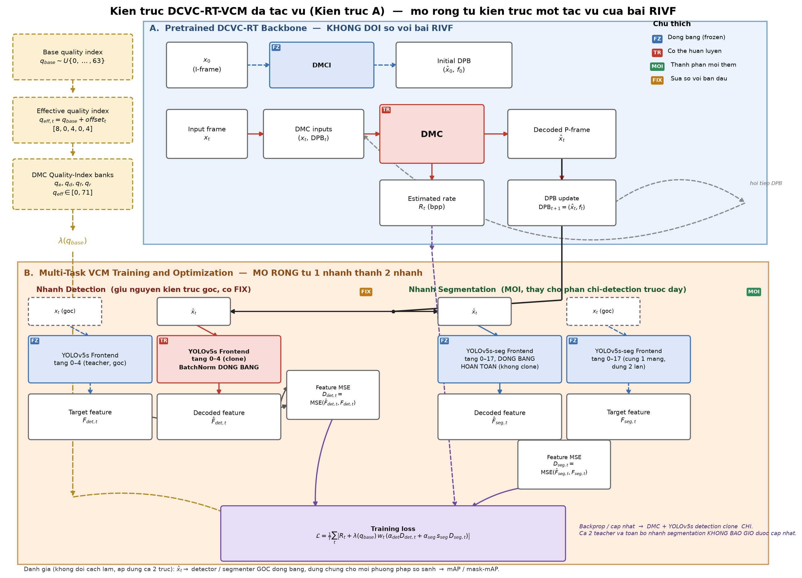

# Cơ sở lý thuyết và thiết kế kiến trúc cho mở rộng đa tác vụ

*Bản nháp chương lý thuyết — khóa luận, mở rộng bài RIVF "Task-Oriented Variable-Rate DCVC-RT for Object Detection" sang detection + instance segmentation.*

---

## 1. Đặt vấn đề

Bài RIVF xây dựng DCVC-RT-VCM: một codec video thần kinh (dựa trên DCVC-RT [Jia et al., 2025]) được huấn luyện lại bằng feature-matching loss giữa ảnh tái tạo và một YOLOv5s đóng băng, để tối ưu trực tiếp cho object detection thay vì chất lượng pixel. Kết quả: BD-rate −62.7 %/−64.6 % (mAP@0.5 / mAP@[0.5:0.95]) so với anchor HEVC trên SFU-HW-Objects-v1, mà không đổi kiến trúc DCVC-RT.

Khóa luận đặt câu hỏi: **cùng một bitstream đó có thể phục vụ đồng thời detection và instance segmentation không, và nếu có thì mất bao nhiêu?** Đây không phải câu hỏi trả lời được bằng suy luận thuần lý thuyết — nó đòi hỏi cả (a) một cơ sở lý thuyết giải thích *vì sao điều này khả dĩ*, và (b) một tập thực nghiệm đo *mức độ* khả dĩ đó, vì lý thuyết multi-task học sâu chỉ cho biết chiều hướng (có thể tốt hơn, có thể tệ hơn), không cho biết độ lớn trên một kiến trúc và cặp tác vụ cụ thể.

Chương này trình bày bốn trụ cột lý thuyết làm nền (§2), chỉ ra ba đặc điểm sẵn có trong chính kiến trúc DCVC-RT-VCM khiến hướng mở rộng này không tùy tiện (§3), thiết kế pipeline cụ thể cùng cơ sở cho từng quyết định (§4), một bảng ánh xạ quyết định → cơ sở → trạng thái chứng minh (§5), và danh sách các mệnh đề bắt buộc phải đo bằng thực nghiệm (§6).

---

## 2. Bốn trụ cột lý thuyết

### 2.1 Video/Image Coding for Machines (VCM)

Duan et al. [vcm, 2020] đặt nền cho VCM: tách rate–distortion optimization khỏi độ méo cảm nhận của con người (MSE/SSIM trên pixel), thay bằng độ méo đo trên đầu ra hoặc đặc trưng trung gian của một mạng tác vụ đích. Đây chính xác là nguyên lý mà cả bài RIVF (một tác vụ) lẫn phần mở rộng của khóa luận (nhiều tác vụ) đều dùng: `L = R + λ·D_task`, với `D_task` không còn ràng buộc gì với domain ảnh.

Điều quan trọng cho khóa luận: literature VCM liệt kê rõ multi-task (detection, segmentation, tracking cùng lúc từ một luồng nén) là một trong các mục tiêu chính của paradigm này, không phải một biến thể ngoài lề. Các công trình gần đây theo hướng "một bitstream, nhiều tác vụ" gồm:

- **Choi & Bajić [choi2022svc, 2022]** — "Scalable Video Coding for Humans and Machines": base layer phục vụ máy (detection), enhancement layer phục vụ người, tiết kiệm 13–19 % bit trên detection so với codec truyền thống.
- **Ge et al. [ge2024taskaware, 2024]** — "Task-Aware Encoder Control for Deep Video Compression": điều khiển encoder theo tác vụ đích, cùng dòng ý tưởng "một codec, nhiều mục tiêu tác vụ".
- Các hướng feature-space multi-task gần đây (PAT-VCM — token phụ trợ nhẹ gắn thêm vào một luồng nén cơ sở dùng chung cho nhiều tác vụ đích; bộ dữ liệu MT-JRD cho detection + instance segmentation + keypoint) xác nhận xu hướng nghiên cứu đang hoạt động, dùng đúng cặp tác vụ liên quan đến khóa luận.

**Kết luận cho §2.1:** hướng "một bitstream, det + seg" nằm đúng trong track VCM đang được nghiên cứu tích cực, không phải giả định tự đặt ra. Điểm mới của khóa luận là áp nguyên lý này vào kiến trúc **cụ thể** của DCVC-RT-VCM (bài RIVF) — điều chưa ai làm với đúng codec, đúng công thức λ, đúng detector này.

### 2.2 Multi-task learning: vì sao chia sẻ biểu diễn có cơ sở, không phải "miễn phí"

Caruana [caruana1997mtl, 1997] — công trình kinh điển: một mạng huấn luyện đồng thời cho nhiều tác vụ liên quan có inductive bias tốt hơn huấn luyện riêng từng tác vụ, **với điều kiện** các tác vụ chia sẻ cấu trúc thống kê bên dưới. Ruder [ruder2017mtl, 2017] hệ thống hóa: kiến trúc chuẩn là biểu diễn chung ở tầng thấp + đầu ra (head) riêng cho từng tác vụ — đúng cấu trúc backbone/neck dùng chung, head khác nhau của YOLOv5 và YOLOv5-seg (§3.2).

Detection và instance segmentation là cặp tác vụ có quan hệ mạnh theo nghĩa này: segmentation về bản chất là detection (định vị đối tượng) cộng thêm một mask pixel-wise trên vùng đã định vị — không phải hai tác vụ độc lập.

Nhưng lý thuyết cũng cảnh báo hiện tượng **negative transfer / task interference**: khi gradient của các tác vụ xung đột hoặc trọng số không cân bằng, thêm tác vụ có thể làm giảm hiệu năng của tác vụ gốc thay vì cải thiện nó. Đây chính là cơ sở lý thuyết cho câu hỏi nghiên cứu RQ1 của khóa luận (đo cụ thể phí tổn trên trục detection khi thêm segmentation vào hàm mục tiêu) và là lý do các công trình sau này (Kendall et al. [kendall2018uncertainty, 2018]) đề xuất học trọng số cân bằng tác vụ thay vì cố định tay.

### 2.3 Giám sát qua đặc trưng (feature-based supervision / knowledge distillation)

Hinton et al. [hinton2015distill, 2015] và Romero et al. [romero2015fitnets, 2015] (FitNets) thiết lập nguyên lý: một mạng học sinh (student) có thể học mô phỏng một mạng giáo viên (teacher) đã huấn luyện sẵn bằng cách khớp biểu diễn trung gian (hint/feature), với gradient chỉ chảy về phía student, teacher giữ nguyên trọng số. Đây **chính xác** là cơ chế mà cả bài RIVF gốc lẫn phần mở rộng đa tác vụ sử dụng: teacher = YOLOv5s(-seg) tiền huấn luyện, đóng băng; student = codec (cộng với một bản sao có thể huấn luyện của các lớp đầu detector, ở nhánh detection); loss = MSE giữa hai đặc trưng.

Lý do dùng feature loss thay vì tối ưu trực tiếp mAP hoặc mask mAP: các chỉ số này đi qua NMS, khớp cặp dự đoán–nhãn (matching), và tích phân theo ngưỡng IoU — **không khả vi**. Feature-matching là proxy khả vi tiêu chuẩn trong toàn bộ literature distillation, không phải kỹ thuật tùy biến riêng của dự án.

### 2.4 Phân tích độ tương đồng biểu diễn (CKA) — cơ sở cho việc chọn tầng giám sát

Kornblith et al. [kornblith2019cka, 2019] đưa ra Centered Kernel Alignment (CKA): độ đo tương đồng giữa hai biểu diễn, bất biến với phép hoán vị kênh — phù hợp để so sánh biểu diễn của hai mạng khác nhau (ở đây: YOLOv5s-detect và YOLOv5s-seg) tại từng tầng. Yosinski et al. [yosinski2014transferable, 2014] cho biết các tầng đầu của một CNN mang tính tổng quát (general — cạnh, kết cấu, cấu trúc không gian cục bộ), các tầng sau mang tính đặc thù tác vụ (specific), và điểm chuyển tiếp general → specific **không cố định**, phải đo thực nghiệm cho từng cặp kiến trúc/tác vụ — không thể suy ra từ lý thuyết chung.

Đây là cơ sở phương pháp luận cụ thể đã dùng trong dự án: đo CKA giữa teacher-detection và teacher-segmentation tại từng tầng của YOLOv5(-seg) trên tập Vimeo (không phải tập test), để xác định tầng nào hai tác vụ còn "nhìn thấy" gần giống nhau (có thể chia sẻ) và tầng nào đã tách biệt (cần giám sát riêng). Kết quả đo được (bước 4, `multitask_exp/measure_task_scales.py`):

| Tầng | Khoảng cách CKA (det vs. seg) so với mốc blur | Diễn giải |
|---|---|---|
| Tầng 4 (frontend, ~14 % độ sâu) | 0.048 (nhỏ nhất) | Hai tác vụ gần như dùng chung biểu diễn |
| Tầng 17 (neck, ~59 % độ sâu) | 0.203 (lớn nhất) | Hai tác vụ đã phân kỳ rõ rệt |

Kết quả này **không phải lựa chọn tùy ý** — nó trùng khớp với việc bài RIVF vốn đã cắt teacher detection tại tầng 4, và cho một căn cứ định lượng để chọn tầng 17 làm điểm giám sát segmentation.

### 2.5 Cơ sở toán học đã chứng minh: mạng Gray–Wyner và "thông tin chung"

Bốn trụ cột ở §2.1–§2.4 giải thích *vì sao đa tác vụ là hướng đáng thử*, nhưng đều dừng ở mức định tính/kinh nghiệm (empirical). Có một kết quả **đã được chứng minh bằng toán học chặt chẽ**, không phải suy diễn, làm nền trực tiếp cho khẳng định "một bitstream chung có thể tốt hơn hai bitstream riêng":

**Định lý Gray–Wyner** [graywyner1974, 1974]. Cho hai nguồn tin tương quan với nhau, có thể mã hóa chúng bằng một kênh **chung** (common) mang phần thông tin hai nguồn chia sẻ, cộng hai kênh **riêng** (private) mang phần thông tin đặc thù mỗi nguồn. Gray và Wyner chứng minh: tồn tại một lượng thông tin gọi là **Wyner common information**, sao cho khi kênh chung được cấp đúng bằng lượng đó, **tổng tốc độ bit (chung + hai riêng) để đạt một cặp độ méo mục tiêu luôn nhỏ hơn hoặc bằng** tổng tốc độ bit của việc mã hóa hai nguồn hoàn toàn độc lập (hai bitstream riêng biệt, không chia sẻ gì) tại cùng cặp độ méo đó. Mức chênh lệch bằng đúng lượng thông tin chung giữa hai nguồn — càng chung nhiều, càng tiết kiệm nhiều; nếu thông tin chung bằng 0, hai cách mã hóa tốn bit ngang nhau (không có gì để mất khi thử multi-task).

Ánh xạ sang bài toán của khóa luận: hai "nguồn tin" là đặc trưng mà detection cần và đặc trưng mà segmentation cần từ cùng một video; "kênh chung" là bitstream DCVC-RT-VCM; "kênh riêng" (nếu có) là phần bù thêm cho từng tác vụ. Định lý Gray–Wyner cho biết: **nếu** hai tác vụ có thông tin chung dương, **thì** về nguyên tắc luôn tồn tại một cách mã hóa chung đạt tổng rate thấp hơn hoặc bằng simulcast (hai bitstream R0 + R1 tách biệt) — đây là câu trả lời trực tiếp cho "dựa vào đâu để nói multi-task có thể tốt hơn baseline hai bitstream riêng".

Công trình rất gần đây của cùng nhóm với [choi2022svc] — de Andrade, Harell & Bajić [deandrade2026graywyner, 2026], ICLR 2026 — hiện thực hóa chính xác ý tưởng này bằng mạng học được (learnable Gray–Wyner network) cho các cặp tác vụ thị giác máy tính, đo trực tiếp "lossy common information" và cho thấy mã hóa chung nhất quán thắng mã hóa độc lập trên sáu bộ dữ liệu thị giác khi hai tác vụ có thông tin chung dương. Đây là bằng chứng cho thấy lập luận Gray–Wyner áp dụng được cho đúng loại bài toán (vision tasks, mạng nơ-ron sâu), không chỉ cho nguồn tin lý tưởng hóa trong lý thuyết thông tin cổ điển.

**Điều kiện của định lý có đang đúng với dự án không?** Đây là chỗ CKA (§2.4) khớp nối trực tiếp vào: CKA không đo được Wyner common information một cách chính xác, nhưng là một **ước lượng gián tiếp** cho việc hai tác vụ có "thông tin chung" đáng kể hay không tại một tầng cụ thể. Gap CKA chỉ 0.048 tại tầng 4 là bằng chứng gián tiếp rằng thông tin detection cần và thông tin segmentation cần, ở độ sâu đó, phần lớn trùng nhau — tức điều kiện tiên quyết của định lý Gray–Wyner (thông tin chung dương) nhiều khả năng thỏa mãn tại chính điểm mà codec đang bị giám sát.

**Giới hạn phải nói rõ.** Định lý Gray–Wyner là một kết quả *achievability* của lý thuyết thông tin cổ điển: nó chứng minh **tồn tại** một bộ mã hóa/tách mã đạt được mức tiết kiệm đó, với giả định blocklength dài tùy ý và bộ mã hóa tối ưu. Nó **không** chứng minh rằng một mạng nơ-ron cụ thể, huấn luyện bằng SGD với một hàm loss tuyến tính hóa cố định, sẽ *tìm ra* bộ mã hóa đó. Đây chính xác là khoảng cách mà §2.2 đã cảnh báo (negative transfer) — và literature tối ưu đa mục tiêu cho công cụ để đo khoảng cách đó trên chính hệ thống đang có:

- **Sener & Koltun [sener2018mtoo, 2018]** chứng minh: nghiệm chạm đúng biên Pareto (tức đạt gần mức tối ưu mà Gray–Wyner hứa hẹn) chỉ được đảm bảo khi tối ưu bằng thuật toán gradient đa mục tiêu (MGDA); một tổng có trọng số **cố định** như công thức đang dùng trong dự án (`α_det`, `α_seg` cố định) chỉ tiếp cận được biên Pareto khi bài toán **lồi** — mạng sâu không lồi, nên có nguy cơ bỏ lỡ một phần biên Pareto mà lẽ ra đạt được.
- **Yu et al. [yu2020pcgrad, 2020]** (PCGrad) cho một tiêu chí đo được cụ thể: **độ tương đồng cosine giữa gradient của `D_det` và `D_seg` đối với tham số codec**. Gradient phần lớn dương/gần trực giao → hai tác vụ đang "hợp tác" trong không gian tham số, dự đoán hệ thống tiệm cận gần cận trên Gray–Wyner. Gradient âm nhiều (xung đột) → negative transfer đang xảy ra thật, dự đoán RQ1 sẽ cho chi phí đáng kể.

**Tóm lại — khung ba tầng trả lời "dựa vào đâu":**

1. **Tầng 1 (đã chứng minh bằng toán, không cần đo):** nếu hai tác vụ có thông tin chung dương, một bitstream chung *có thể* đạt tổng rate ≤ simulcast tại cùng cặp độ méo — định lý Gray–Wyner [graywyner1974], hiện thực hóa cho vision bởi [deandrade2026graywyner].
2. **Tầng 2 (đã đo, dùng làm bằng chứng gián tiếp cho điều kiện của Tầng 1):** CKA gap 0.048 tại tầng 4 cho thấy detection và segmentation gần như dùng chung biểu diễn ở điểm codec đang bị giám sát — điều kiện "thông tin chung dương" nhiều khả năng thỏa.
3. **Tầng 3 (rủi ro đã biết trước, phải đo để biết mức độ):** tối ưu bằng SGD + trọng số cố định không đảm bảo chạm cận trên của Tầng 1 [sener2018mtoo]; mức chênh lệch thực tế được dự đoán bởi độ xung đột gradient [yu2020pcgrad] và được đo trực tiếp bằng BD-rate thực nghiệm — chính là RQ1.

Nói cách khác: phần "chứng minh được" là **điều kiện** (Tầng 1) và **dấu hiệu điều kiện đó đang đúng** (Tầng 2); phần "không chứng minh được, phải đo" là **mức độ đạt được** trong thực tế huấn luyện (Tầng 3). Đây là giới hạn chuẩn của toàn ngành khi áp lý thuyết thông tin vào mạng sâu, không phải né tránh câu hỏi.

**Một phép đo bổ sung, rẻ, chưa làm:** tính cosine similarity giữa `∇_θ D_det` và `∇_θ D_seg` (θ = tham số codec) trên vài batch, dùng ngay checkpoint R2b hiện có — không cần huấn luyện lại. Đây là bằng chứng độc lập cho Tầng 3, có trước khi đợi đủ kết quả BD-rate.

---

## 3. Vì sao chính kiến trúc DCVC-RT-VCM đã có sẵn "chỗ hở" cho đa tác vụ

Ba đặc điểm sau xuất phát trực tiếp từ kiến trúc đã triển khai, không phải suy diễn trừu tượng:

**3.1 — Điểm cắt teacher nông.** Bài gốc cắt teacher tại tầng 4/29 của YOLOv5s (dưới 15 % độ sâu mạng). Theo Yosinski et al., tầng nông mang tính tổng quát, về nguyên tắc *chưa* đặc thù cho detection. Phép đo CKA (§2.4) xác nhận trực tiếp: tại tầng 4, biểu diễn của teacher-detection và teacher-segmentation gần như trùng nhau.

**3.2 — Kiến trúc dùng chung của YOLOv5 và YOLOv5-seg.** Đây là fact kiến trúc (Ultralytics YOLOv5 [yolov5]), không phải giả định: hai mô hình dùng chung backbone (CSPDarknet) và neck (PANet), chỉ khác nhau ở head cuối cùng — YOLOv5-seg thêm một nhánh proto-mask trên cùng một biểu diễn neck. Do đó, về nguyên tắc một bitstream tái tạo đủ tốt tại điểm phân nhánh backbone/neck có thể "nuôi" cả hai head mà không cần hai codec riêng biệt cho hai tác vụ.

**3.3 — Công thức loss đã tách khỏi pixel từ trước.** Loss của DCVC-RT-VCM gốc là `L = R + λ(q)·w_t·D_feature`, trong đó `D_feature` không ràng buộc gì với không gian ảnh. Mở rộng `D` thành tổng có trọng số của nhiều distortion (multi-task) là một phép **tuyến tính hóa đa mục tiêu (weighted-sum scalarization)** tiêu chuẩn — không cần thay đổi công thức rate–distortion nền tảng, chỉ mở rộng thành phần D. Đây là hướng tiếp cận cùng họ với Kendall et al. [kendall2018uncertainty, 2018], chỉ khác ở cách xác định trọng số (xem §4).

---

## 4. Thiết kế kiến trúc / pipeline (Kiến trúc A)

**Hình.** Kiến trúc đa tác vụ, mở rộng từ kiến trúc một tác vụ của bài RIVF (Fig. 2). Vùng A (backbone DCVC-RT) giữ nguyên không đổi. Vùng B mở rộng từ một nhánh (chỉ detection) thành hai nhánh song song: nhánh detection giữ nguyên kiến trúc gốc nhưng có sửa lỗi BatchNorm (nhãn **FIX**), nhánh segmentation là thành phần hoàn toàn mới (nhãn **MOI**). Nhãn **FZ** (xanh) = đóng băng, **TR** (đỏ) = có thể huấn luyện — quy ước màu giữ nguyên như hình gốc, chỉ đổi icon thành chữ tắt để tương thích font khi biên dịch.

**Ba thay đổi cụ thể so với kiến trúc một tác vụ của bài RIVF:**

| # | Thay đổi | Vì sao (cơ sở ở §2–§3) |
|---|---|---|
| 1 (MỚI) | Thêm nhánh segmentation: YOLOv5s-seg tầng 0–17, đóng băng hoàn toàn, không có bản sao huấn luyện | CKA gap lớn nhất tại tầng 17 (§2.4) — điểm hai tác vụ phân kỳ, cần giám sát riêng; đóng băng hoàn toàn để tránh lặp lại lỗi lệch phân phối train/eval |
| 2 (FIX) | BatchNorm của bản sao detection giữ ở eval mode trong suốt huấn luyện | Phát hiện thực nghiệm: BatchNorm ở train mode làm loss mù với thay đổi độ sáng/tương phản/màu, gây sụp checkpoint (§4, mục "Nhánh detection") |
| 3 | Loss mở rộng thành tổng có trọng số của hai distortion: `α_det·D_det + α_seg·seg_scale·D_seg`, với `α_det+α_seg=1` | Scalarization đa mục tiêu tuyến tính, mở rộng trực tiếp từ `L=R+λ·w·D` của bài gốc (§3.3) |

Vùng A (I-frame init DMCI, P-frame recurrent DMC, quality-index conditioning, λ(q)) và luồng đánh giá (detector/segmenter gốc đóng băng, dùng chung cho mọi phương pháp so sánh) giữ nguyên không đổi.

**Luồng huấn luyện:**

1. Video gốc (RGB) đi qua DCVC-RT encoder/decoder (DMCI intra + DMC inter) — **kiến trúc không đổi**, chỉ trọng số được tinh chỉnh qua backprop từ loss bên dưới.
2. Frame tái tạo (RGB) đi qua hai nhánh song song:
   - **Nhánh detection:** YOLOv5s tầng 0–4, một bản sao có thể huấn luyện, nhưng BatchNorm đóng băng ở eval mode. Cho `D_det` = MSE với đặc trưng của teacher-detection (gốc, đóng băng) tại cùng tầng.
   - **Nhánh segmentation:** YOLOv5s-seg tầng 0–17, đóng băng hoàn toàn (không có bản sao). Cho `D_seg` = MSE với đặc trưng của teacher-segmentation (gốc, đóng băng) tại tầng 17.
3. Loss tổng: `L = R + λ(q)·w_t·(α_det·D_det + α_seg·seg_scale·D_seg)`. Gradient chỉ chảy về codec và bản sao detection; hai teacher và nhánh segmentation không bao giờ được cập nhật.

**Luồng đánh giá (không huấn luyện):** frame tái tạo đi qua YOLOv5s / YOLOv5s-seg **gốc**, tiền huấn luyện, đóng băng hoàn toàn (`--force-pretrained-frontend`), bất kể checkpoint được huấn luyện bằng nhánh nào — cho ra mAP / mask mAP để đánh giá cuối cùng.

Cơ sở cho từng quyết định thiết kế:

- **Encoder/decoder DCVC-RT không đổi kiến trúc.** Giữ nguyên khả năng tái sử dụng hạ tầng bitstream/entropy-coder đã kiểm chứng của bài gốc; đúng tinh thần VCM (§2.1) — codec không cần biết trước tác vụ đích, chỉ tối ưu qua loss lúc huấn luyện.
- **Nhánh detection: bản sao có thể huấn luyện, nhưng BatchNorm đóng băng ở eval mode.** Đây vừa là kế thừa đúng công thức đã tạo ra checkpoint của bài gốc (script huấn luyện gốc gọi `freeze_bn()` sau mỗi `system.train()`), vừa là một **phát hiện thực nghiệm** của khóa luận, không suy được từ lý thuyết distillation chung: nếu để BatchNorm chạy ở train mode (chuẩn hóa theo thống kê của một batch 2 clip), loss trở nên gần như mù với thay đổi độ sáng/tương phản/màu so với detector đánh giá thực tế, và một ảnh giống hệt vẫn bị tính loss khác 0. Đây là ví dụ cụ thể cho thấy công thức "teacher đóng băng + student sao chép" (§2.3) không tự động đúng khi triển khai — chi tiết vận hành (BatchNorm) phải được kiểm chứng riêng.
- **Nhánh segmentation: đóng băng hoàn toàn, không có bản sao huấn luyện, giám sát tại tầng 17.** Theo đúng bằng chứng CKA (§2.4, §3.1): tại tầng 17 hai tác vụ đã phân kỳ đủ để không thể dùng chung một bản sao nông như detection; đóng băng hoàn toàn tránh nguy cơ lệch phân phối train/eval nêu trên, đổi lại giới hạn khả năng "điều chỉnh" biểu diễn theo yêu cầu riêng của segmentation — đây là một đánh đổi (trade-off), độ lớn của nó là một phần của RQ2/RQ3.
- **λ(q) = 64^(q/63)** (lịch trình log-tuyến tính theo QP, kế thừa nguyên Eq. 5 của bài gốc) nhân với `w_t` (trọng số thời gian phân tầng, kế thừa) nhân với `(α_det·D_det + α_seg·seg_scale·D_seg)`: một scalarization tuyến tính chuẩn cho bài toán đa mục tiêu. `α` là siêu tham số **cố định**, không học theo bất định (uncertainty) như Kendall et al. — đây là đơn giản hóa có chủ đích do giới hạn ngân sách (Kaggle T4, 1–2 tháng không đủ để sweep uncertainty-weighting hay tìm kiến trúc trọng số tối ưu); giới hạn này được nêu rõ, không che giấu.
- **`seg_scale` hiệu chỉnh bằng trung bình nhân của tỉ lệ D_det/D_seg đo trên Vimeo** (không phải trên tập test SFU), để `α_seg·seg_scale·D_seg` có cùng bậc độ lớn với `α_det·D_det` trước khi trọng số α phân bổ ngân sách giữa hai tác vụ. Đúng nguyên tắc "không chọn siêu tham số trên tập test" mà bài gốc đã tuyên bố.
- **Đánh giá luôn dùng detector/segmenter gốc, tiền huấn luyện, đóng băng hoàn toàn.** Đây là điều kiện công bằng bắt buộc: nếu đánh giá bằng chính bản sao đã huấn luyện cùng codec, kết quả sẽ lẫn giữa "codec nén tốt hơn" và "bản sao học được cách bù trừ lỗi nén" — hai điều hoàn toàn khác nhau về ý nghĩa thực tế triển khai.

---

## 5. Bảng ánh xạ: quyết định thiết kế → cơ sở → trạng thái chứng minh

| # | Quyết định thiết kế | Cơ sở lý thuyết / tài liệu | Trạng thái |
|---|---|---|---|
| 1 | Độ méo đo trong không gian đặc trưng, không phải pixel | VCM paradigm [vcm]; kế thừa từ bài RIVF | Đã có trong bài gốc |
| 2 | Một bitstream chung cho detection + segmentation | **Định lý Gray–Wyner** [graywyner1974; deandrade2026graywyner]: thông tin chung dương ⇒ tổng rate ≤ simulcast, về nguyên tắc; MTL chia sẻ biểu diễn [caruana1997mtl; ruder2017mtl]; backbone/neck dùng chung của YOLOv5/-seg | Điều kiện (thông tin chung dương) có bằng chứng gián tiếp qua CKA — **mức đạt được thật cần đo, RQ1** |
| 3 | Tầng giám sát detection = tầng 4 | CKA gap nhỏ nhất tại tầng này [kornblith2019cka] | Đã đo, xác nhận |
| 4 | Tầng giám sát segmentation = tầng 17 | CKA gap lớn nhất tại tầng này | Đã đo, xác nhận |
| 5 | Nhánh segmentation đóng băng hoàn toàn, không sao chép | Tránh lệch phân phối train/eval (phát hiện thực nghiệm BatchNorm, không suy từ lý thuyết chung) | Xác nhận gián tiếp: run chỉ-segmentation (không sao chép) không sụp như hai run có sao chép |
| 6 | Feature loss thay cho tối ưu trực tiếp mAP/mask mAP | Distillation / FitNets [hinton2015distill; romero2015fitnets] | Kế thừa chuẩn |
| 7 | Trọng số tác vụ cố định, không học bất định | Đơn giản hóa có chủ đích so với [kendall2018uncertainty], do giới hạn ngân sách | Giới hạn đã biết, nêu rõ trong luận văn |
| 8 | Chi phí đa tác vụ trên trục detection = BD(R2) − BD(R0) | Cận trên đã chứng minh bởi Gray–Wyner (mục 2 ở trên); độ chênh so với cận trên đó dự đoán được bởi độ xung đột gradient [sener2018mtoo; yu2020pcgrad] | **Phải đo độ lớn — RQ1, đang chạy** |
| 9 | Chỉ huấn luyện segmentation giữ lại bao nhiêu detection | Không suy được từ lý thuyết — phụ thuộc mức chồng lấp CKA thực tế giữa hai tác vụ | **RQ2, đang chạy** |
| 10 | So với simulcast (hai bitstream riêng, R0 + R1) | Định lý Gray–Wyner cho biết multi-task **có thể** thắng simulcast khi thông tin chung dương [graywyner1974]; không đảm bảo đạt được bằng SGD [sener2018mtoo] | **RQ3, cần trục mask mAP (KITTI-MOTS) trước khi tính** |
| 11 | Độ xung đột gradient giữa D_det và D_seg (chưa đo) | Tiêu chí chẩn đoán negative transfer trực tiếp trên tham số codec [yu2020pcgrad] | Chưa đo — rẻ, dùng checkpoint R2b sẵn có, không cần huấn luyện lại |

---

## 6. Những gì bắt buộc phải đo bằng thực nghiệm

Lý thuyết ở §2–§4 giải thích **vì sao** hướng đi này có cơ sở và **những giới hạn nào đã biết trước**, nhưng không một phần nào trong đó cho biết **độ lớn** của các đại lượng sau — đây là phần thực nghiệm không thể thay thế bằng lập luận:

1. **RQ1 — Chi phí đa tác vụ trên detection:** `BD-rate(R2) − BD-rate(R0)` trên trục mAP, cùng anchor HEVC, cùng bộ SFU Class C/D.
2. **RQ2 — Detection còn lại khi chỉ huấn luyện segmentation:** `BD-rate(R1) − BD-rate(R0)`.
3. **RQ3 — So với simulcast:** cần trục mask mAP (KITTI-MOTS, chưa triển khai) để so tổng bitrate của (bitstream-R0 + bitstream-R1 riêng biệt) với bitstream-R2 chung, tại cùng cặp (mAP, mask-mAP) mục tiêu.
4. **Độ nhạy với `seg_scale`:** giá trị hiệu chỉnh trên Vimeo có giữ nguyên ý nghĩa khi chuyển sang SFU (miền dữ liệu khác) hay không.
5. **Mức độ negative transfer thực tế** so với ngưỡng dự đoán bởi CKA — tức là liệu khoảng cách CKA 0.203 tại tầng 17 có tương quan định lượng với độ sụt mAP đo được, hay chỉ mang tính định tính.
6. **Độ xung đột gradient** giữa `D_det` và `D_seg` đối với tham số codec (§2.5) — dự đoán trực tiếp khoảng cách giữa cận trên Gray–Wyner và kết quả thực đo; chưa thực hiện, không cần huấn luyện lại.

Nói ngắn gọn cho câu hỏi "dựa vào đâu để chứng minh multi-task sẽ tốt": **phần chứng minh được** là định lý Gray–Wyner (§2.5) — nếu hai tác vụ có thông tin chung dương, một bitstream chung *có thể* đạt tổng rate không tệ hơn hai bitstream riêng; **phần đã có bằng chứng đo được** là CKA gap nhỏ tại tầng 4, gợi ý điều kiện đó đang đúng; **phần chưa chứng minh được và phải đo** là liệu quá trình huấn luyện bằng SGD với trọng số cố định có *đạt* được mức đó hay không — đó là nội dung của RQ1.

---

## Tài liệu tham khảo

Các mục đã có trong `rivf_paper/references.bib` (dùng lại nguyên key): `vcm`, `choi2022svc`, `ge2024taskaware`, `dcvcrt`, `yolov5`, `sfuobjects`, `vimeo90k`.

Các mục bổ sung cho chương lý thuyết này — xem `multitask_exp/docs/multitask_references.bib`:

- Caruana, R. (1997). *Multitask Learning*. Machine Learning, 28(1), 41–75.
- Ruder, S. (2017). *An Overview of Multi-Task Learning in Deep Neural Networks*. [arXiv:1706.05098](https://arxiv.org/abs/1706.05098).
- Hinton, G., Vinyals, O., & Dean, J. (2015). *Distilling the Knowledge in a Neural Network*. [arXiv:1503.02531](https://arxiv.org/abs/1503.02531).
- Romero, A., Ballas, N., Kahou, S. E., Chassang, A., Gatta, C., & Bengio, Y. (2015). *FitNets: Hints for Thin Deep Nets*. ICLR 2015. [arXiv:1412.6550](https://arxiv.org/abs/1412.6550).
- Yosinski, J., Clune, J., Bengio, Y., & Lipson, H. (2014). *How transferable are features in deep neural networks?* NeurIPS 2014. [arXiv:1411.1792](https://arxiv.org/abs/1411.1792).
- Kornblith, S., Norouzi, M., Lee, H., & Hinton, G. (2019). *Similarity of Neural Network Representations Revisited*. ICML 2019. [proceedings.mlr.press/v97/kornblith19a](http://proceedings.mlr.press/v97/kornblith19a/kornblith19a.pdf).
- Kendall, A., Gal, Y., & Cipolla, R. (2018). *Multi-Task Learning Using Uncertainty to Weigh Losses for Scene Geometry and Semantics*. CVPR 2018, 7482–7491.
- Duan, L.-Y., Liu, J., Yang, W., Huang, T., & Gao, W. (2020). *Video Coding for Machines: A Paradigm of Collaborative Compression and Intelligent Analytics*. IEEE TIP, 29, 8680–8695. [arXiv:2001.03569](https://arxiv.org/abs/2001.03569).
- Choi, H., & Bajić, I. V. (2022). *Scalable Video Coding for Humans and Machines*. IEEE MMSP 2022. [arXiv:2208.02512](https://arxiv.org/abs/2208.02512).
- Ge, X., Luo, J., Zhang, X., Xu, T., Lu, G., He, D., Geng, J., Wang, Y., Zhang, J., & Qin, H. (2024). *Task-Aware Encoder Control for Deep Video Compression*. CVPR 2024, 26036–26045.
- Jia, Z., Li, B., Li, J., Xie, W., Qi, L., Li, H., & Lu, Y. (2025). *Towards Practical Real-Time Neural Video Compression*. CVPR 2025. [arXiv:2502.20762](https://arxiv.org/abs/2502.20762).
- Gray, R. M., & Wyner, A. D. (1974). *Source Coding for a Simple Network*. Bell System Technical Journal, 53(9), 1681–1721. [doi:10.1002/j.1538-7305.1974.tb02812.x](https://doi.org/10.1002/j.1538-7305.1974.tb02812.x).
- de Andrade, A., Harell, A., & Bajić, I. V. (2026). *Lossy Common Information in a Learnable Gray-Wyner Network*. ICLR 2026. [arXiv:2601.21424](https://arxiv.org/abs/2601.21424).
- Sener, O., & Koltun, V. (2018). *Multi-Task Learning as Multi-Objective Optimization*. NeurIPS 2018. [arXiv:1810.04650](https://arxiv.org/abs/1810.04650).
- Yu, T., Kumar, S., Gupta, A., Levine, S., Hausman, K., & Finn, C. (2020). *Gradient Surgery for Multi-Task Learning*. NeurIPS 2020. [arXiv:2001.06782](https://arxiv.org/abs/2001.06782).
